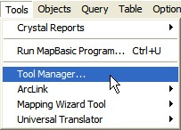
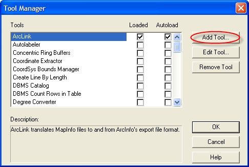
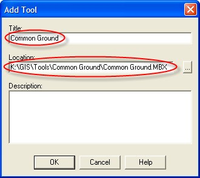
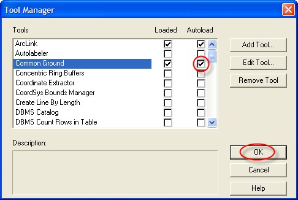

# Common Ground

Common Ground is a MapInfo plugin (MBX) that enables Victorian councils to update, correct and track changes to their property map base. Specifically, it provides a graphical interface to guide council staff in compiling the required information to complete the 'M1' spreadsheet for submitting to the state government.

*Note: Common Ground is considered a semi-manual method of filling in M1s. For a more automated solution, see Groundtruth's [Pozi Connect for M1s](http://www.groundtruth.com.au/pozi-connect-for-m1s).*

## Installation

The Common Ground.mbx and associated files typically reside on a network drive where it is accessible to multiple users.

The following instructions assume that these files have already been set up on your network by Groundtruth, and that you're wanting to make it accessible for a new user or new PC.

### MapInfo Tool Manager

In MapInfo Professional, go to the Tools menu and select Tool Manager.

### Add Tool

If Common Ground is not already listed in the Tool Manager, click
'Add Tool'.

### Input Settings for Common Ground

Type in 'Common Ground' and specify the location of the Common
Ground MBX file on the network.

### Set Common Ground to Autoload

Check the 'Autoload' tickbox for Common Ground to ensure it loads up whenever MapInfo starts.

## Change Settings

Common Ground maintains its settings in a configuration file (Common Ground.ini) in the same folder as the application (Common Ground.mbx) file.

With any changes you make in the configuration, you will need to restart MapInfo after you update the INI file for change to take effect.

### Change M1 Output Location

Update the `OutputFolder` setting in the INI file. The folder name will need to maintain the trailing slash.

## DSN

The user's PC will need to have a DSN (Data Source Name)that enables it to connect to the council's property and rating system.

This is configured using the Windows Control Panel:

    Control Panel >
        Administrator Tools >
            ODBC Data Sources >
                System DSN

Obtain the settings from your IT administrator.

The name given to the DSN needs to exactly match the `ODBCConnectionString` setting in the Common Ground INI file.

For example, if the DSN for the property system is 'pthprod', then the INI file setting will look something like this:

    ODBCConnectionString = DSN=pthprod;UID=pthprod;PWD=...

### Running in Windows 64 bit

When running a 64 bit version of Windows, you need to set up your DSN as 32 bit so that MapInfo Professional can recognise it. (The standard control panel will only let you set up 64 bit DSNs.)

To set up a 32 bit DSN, bring up Run dialog using Windows Key + R, then paste in: `c:\windows\sysWOW64\odbcad32.exe`.

This enables you to set up the DSN as 32 bit, and MapInfo (and therefore Common Ground) will be able to recognise it.

### Troubleshooting

If you experience an error like `DBMSS Table or View ... not found in Database. No columns in table ...`, check your DSN, and ensure that your property database is the *default* database.
